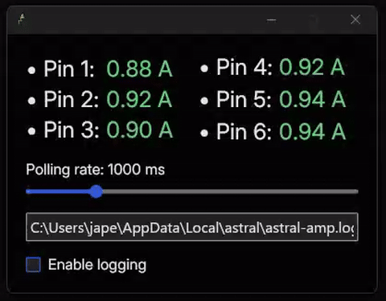

# Astral Flow Meter (for ROG Astral 5080/5090 GPUs)



Astral Flow Meter is a Rust-based application designed to log amperage data from Asus ROG Astral 5090/5080 GPUs. This project was created for personal use and is not officially supported or endorsed by Asus.

> **Note:** This application only works with Nvidia Asus ROG Astral 5090/5080 GPUs. It is not compatible with other GPU models.

## Features

- Provides a graphical interface to monitor and configure logging settings.
- Allows logging amperage data from Nvidia Asus ROG Astral 5090/5080 GPUs.
- Allows customization of polling rates and log file paths.

## Requirements

This application requires the proprietary `ExpanModule.dll` from Asus GPU Tweak III v1.9.0.3 or newer. You must obtain this DLL yourself, as it is not included in this repository. The application will not function without it.

## Installation

### Prebuilt
1. Download the latest release.
2. Place the ExpanModule.dll file in the same directory as the executable or ensure it is located in the default directory: `C:\Program Files (x86)\ASUS\GPUTweakIII\ExpanModule.dll`.
3. Run the binary.

### From source
1. Clone this repository:
   ```bash
   git clone https://github.com/Lemminkyinen/astral-flow-meter.git
   cd astral-flow-meter
   ```

2. Install Rust if you haven't already: [Rust Installation Guide](https://www.rust-lang.org/tools/install).
3. Build the project as a 32-bit executable:
   ```bash
   rustup target add i686-pc-windows-msvc
   cargo build --release --target=i686-pc-windows-msvc
   ```
4. Optionally build the project with with embedded ``ExpanModule.dll``. Requires the .dll file to be in the repository root:
   ```bash
   rustup target add i686-pc-windows-msvc
   cargo build --release --target=i686-pc-windows-msvc -F embed-dll
   ```

5. Place the `ExpanModule.dll` file in the same directory as the executable or ensure it is located in the default directory: `C:\Program Files (x86)\ASUS\GPUTweakIII\ExpanModule.dll`.

6. Run the built binary.

## Usage
The application will attempt to load the ExpanModule.dll from the following locations in order:

1. The same directory as the executable.
2. The default directory: `C:\Program Files (x86)\ASUS\GPUTweakIII\ExpanModule.dll`.

If the DLL is not found in these locations, you will be prompted to provide its path manually. 

Configure the polling rate and logging options as needed.

## Limitations
This application only works with Nvidia Asus ROG Astral 5090/5080 GPUs.
It relies on the proprietary ExpanModule.dll from Asus GPU Tweak III.

## License
This project is licensed under the MIT License. See the LICENSE file for more details.

## Disclaimer
- **Use at your own risk.** I am not responsible for any issues, damages, or consequences that may arise from using this application.
- This project was created for personal needs and is provided "as is" without any guarantees or warranties.
